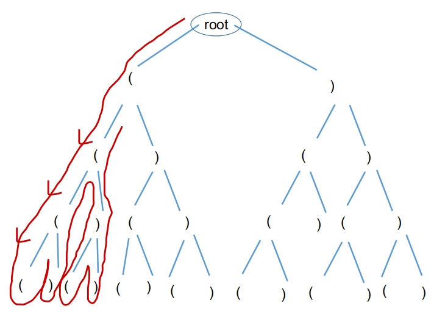
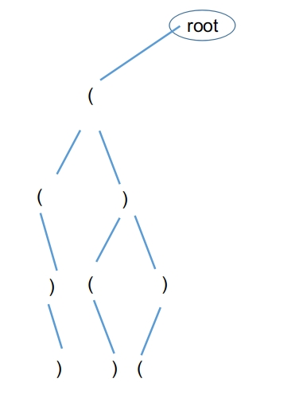

# 22-括号生成

## [题目](https://leetcode-cn.com/problems/generate-parentheses/)(难度中等)

给出 n 代表生成括号的对数，请你写出一个函数，使其能够生成所有可能的并且有效的括号组合。

例如，给出 n = 3，生成结果为：

```
[
  "((()))",
  "(()())",
  "(())()",
  "()(())",
  "()()()"
]
```

### 算法知识点
1. 回溯法（深度搜索）(暴力法)
这种方法通过遍历所有可能的解空间，并依次判断每个可能的括号字符串是否合法。在遍历解空间的时候，按照先放置 '(' ，再放置 ')' 的顺序进行。
解空间树如下：(n = 2)


2. 回溯法（深度搜索）+ 剪枝
这种方法同样是通过回溯（按深搜索）来遍历解空间，但通过条件的设置进行剪枝。（无需要验证，直接就是精确解空间）
解空间树如下：(n = 2)


3. 闭合数法
待理解。。。

### 编程知识点
1. 